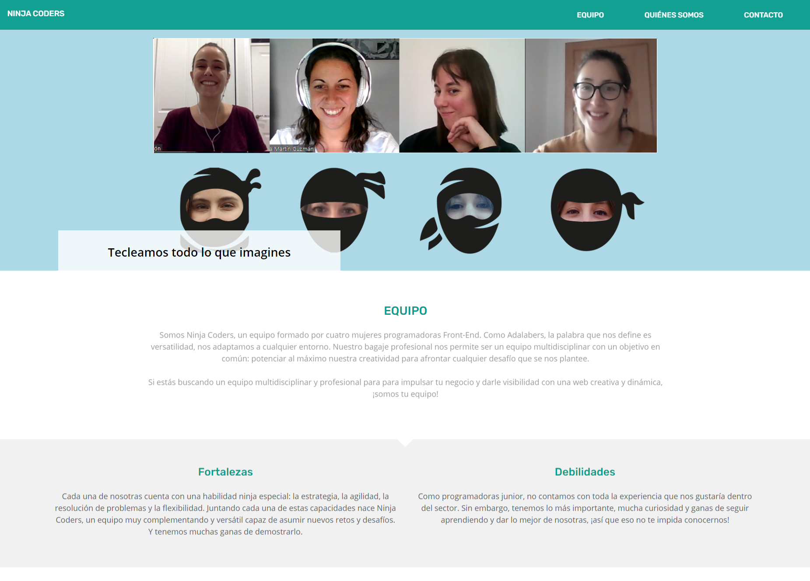
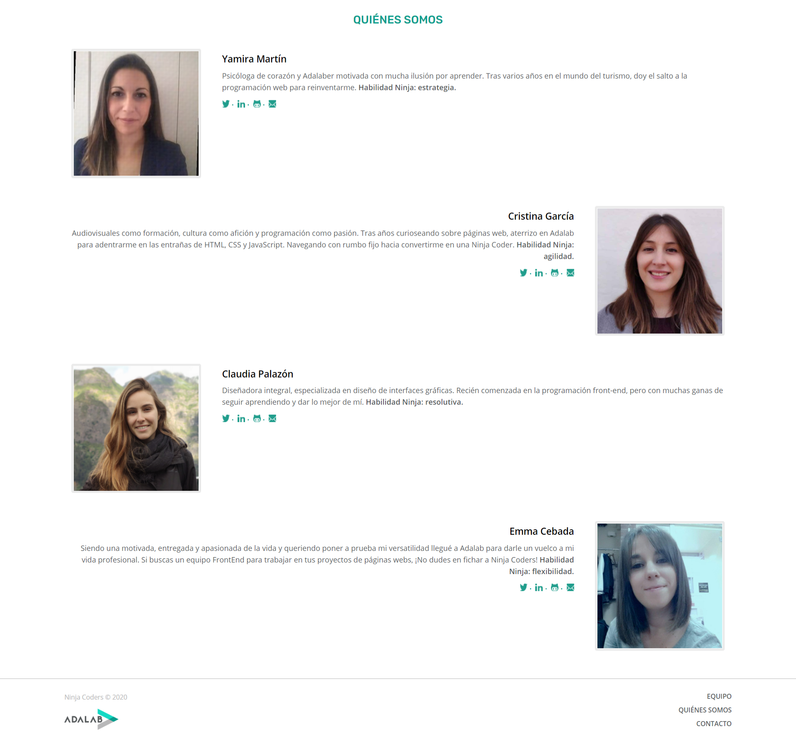

# Ninja Coders

Este es el **proyecto del módulo 01 de Adalab**. El proyecto consiste en el desarrollo de una web colaborativa del equipo **Ninja Coders**. El objetivo principal es mostrar las capacidades y habilidades de las integrantes del equipo, con el fin de que las empresas puedan conocer nuestro trabajo y facilitar el contacto si quisieran contar con nosotras para sus proyectos. Este producto ofrece una forma dinámica e interactiva de conocer nuestras capacidades como programadoras, tanto a nivel equipo como individual, ya que es una forma cómoda y práctica de encontrar programadoras junior con habilidades distinguidas, y por tanto facilita la interacción entre recruiters y candidatas.

## Demo

Para ver el resultado del desarrollo de la página web puedes visitar el siguiente enlace: https://beta.adalab.es/project-promo-k-module-1-team-8/.

## Tecnologías utilizadas

<Imagen de los iconos HTML5, CSS3, SASS, GULP, GIT>

Nuestra página está maquetada en HTML5 y CSS3. Además, nos hemos servido del preprocesador SASS y de Gulp. Con la utilización de estas tecnologías hemos conseguido automatizar tareas, trabajar con un código más ordenado y limpio, a la vez que optimizado para que nuestra web cargue rápidamente. Con respecto al control de versiones, hemos creado diferentes ramas según la funcionalidad de cada una, solventando los conflictos con soltura.

El desarrollo del ejercicio se ha llevado a cabo utilizando el [Starter Kit de Adalab](https://github.com/Adalab/adalab-web-starter-kit), creado en node y gulp. Se trata de una plantilla de proyecto con funcionalidades preinstaladas y preconfiguradas. Este Kit incluye un motor de plantillas HTML, el preprocesador SASS y un servidor local, además de otras herramientas como Gulp, que nos ayuda en la automatización de tareas.

## Desarrollo

En primer lugar, nuestra web se ha maquetado en **mobile first**, adaptando el diseño a diferentes tamaños de pantalla. Nuestra página principal `index.html` está dividida en cuatro secciones principales: header, team, who we are y footer.

- El header está compuesto por un menú de navegación fijo, una imagen animada y un _claim_.
- En la siguiente sección se muestra una breve descripción del equipo, sus fortalezas y debilidades.

- En la sección de _Quiénes Somos_ se presenta brevemente a las integrantes del equipo, su habilidad ninja y los métodos de contacto con cada una: twitter, linkedin, github y email.
- El footer consta del mismo menú de navegación que el header aunque con diferente estructura.

La página de `contact.html` mantiene el header y el footer e implementa un formulario que recoge información de contacto como nombre completo, email, teléfono y mensaje y un botón para poder enviarlo. Así, cualquier persona interesada en nuestros servicios puede ponerse en contacto con nosotras.

## Instalación

Para poder usar este proyecto tienes que seguir estos pasos:

- Clonar el repositorio
- Instalar las dependencias con `npm install`
- Arrancar el proyecto con `npm start`

---

Este proyecto ha sido desarrollado por **[Claudia Palazón](https://github.com/claudiapalazon), [Cristina García](https://github.com/crisgarm), [Emma Cebada](https://github.com/Emma-cebada) y [Yamira Martín](https://github.com/ymartinguzman)**.

_Ninja Coders © 2020_
